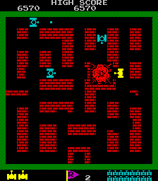

# Tiny Tanks Project



## Widgets

Base widget class **important**

The base widget class defines basic functionality shared between all widgets. Every widget
should have a position and origin. Where position is the point at which the widget is drawn and origin
is the point used for rotation and scaling. Each widget should be identifiable by a enum type. The widgets
should also have a render target window (that the widget is drawn on) passed in constructor and this target should be changeable by a function.
Finally every widget should drawable and describe how it should be drawn via draw function to allow things like Widget* x->draw(). This draw
function should of course use our target render window.

```
mywidget(Render_window*)

set_pos
get_pos

set_origin
get_origin

is()

set_render_target(Render_window const*)

draw()

vector2f       m_origin;
vector2f       m_pos;
Render_window* m_window;
```
